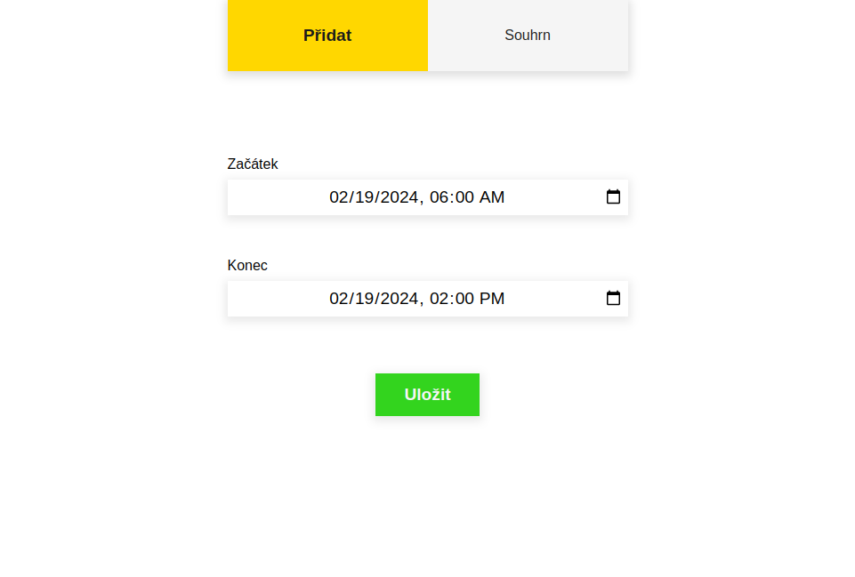
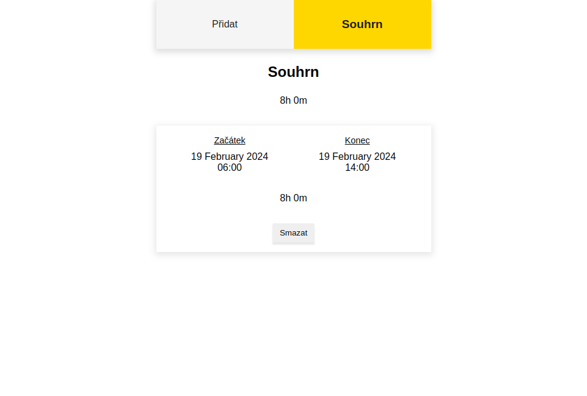

 
 

# Introduction

### Web application for tracking time spent at work with a summary of individual days and total time spent at work.

 
 

# Used technologies

 

 
 

# Time spent

 

 
 

# Preview

 

 

